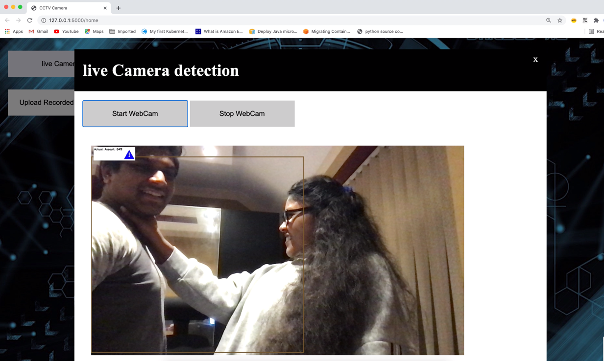
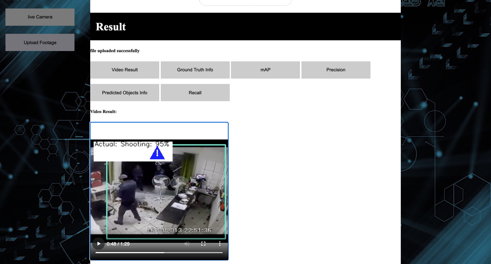

# An Autonomous Surveillance System That Detects Whether A Person Is A Suspect Or Not

Creating a real-time detection system to automatically detect whether a person is a suspect or not from their actions 
provided in the footage. This is done by determining whether a person behaviour is similar to crimes or illegal 
activities like robbery, abuse, arson, etc. The Faster R-CNN deep learning algorithm and VGG16 for an image pre-trained 
image classification are used to detect their behaviour.


## Launch the website:
### video uploading detection
The recorded footage detection by loading the website and then clicking on the upload video option. This will open the 
uploaded video webpage for the user to upload the video. Once they upload a video, it starts the detection process by 
handling video upload on the local server using the POST method in the flask as a server-end point. Then, it will 
extract the input video into one frame per second, which will be stored in a test image folder. These image frames will 
be used to process the testing using Faster R-CNN on VGG 16 network. After the testing process is done for every image 
frame, it will convert those result frames into video and produces some graph results, such as ground truth classes, 
predicted classes, mAP, Precision and Recall calculations.

### live-streaming detection
The live detection done by getting an image frame for every 3 seconds from backend end- point services (from flask 
API via call HTTP API (using AJAX in browser). The reason for getting the image frames every 3 seconds is that there 
is not enough CPU processor to capture frame for each second, as this is one of the improvements for further work. 
These image frames will be used to process the testing using Faster R-CNN on VGG 16 network.

The system will display detected suspicious behaviour that occurred in the image frame containing bounding boxes, name of the crime that occurs in the image frame, accuracy score and a warning sign to alert
The autonomous suspicious human behaviour detection must be successful in forming an interaction model that can learn the relationship between the different criminal activities, such as robbery, abuse, arson, etc. Also, able to match human behaviours to the pre-trained crime activity classes. Few frameworks are produced to describe the overall design of this project includes data-flow diagrams of the website for the customers to operate the detection and a UML diagram explaining the backend process such as frame extracting, faster R- CNN and VGG16 network methodologies. This section allows used as guidance to develop the real-time detection system for suspicious human behaviour.
the user that there is a suspicious person is found.

### [Slides](https://universityofexeteruk-my.sharepoint.com/:p:/g/personal/pt366_exeter_ac_uk/EfJkoxB5-IRIg64ezPumGkMB_ilvVqeJ8CZg_VPhHPpvLQ?email=pt366%40exeter.ac.uk&e=luOddw)

## Usage and Requirements:
* Tensorflow and keras backends are supported.

* Install all the packages from the `requirements.txt` to run this project.

* Test videos are found in the `test_videos` folder in the `data` folder.

* The CCTV footage dataset are collected from `https://www.crcv.ucf.edu/projects/real-world/`.

* `config.py` is used to control and change the parameters of the model for training and testing according to their
    needs. This file is found in the fast_rcnn folder.

* `simple_parser.py` allows to Parse the data from annotation file for training and testing process.Also,
  Provides an annotation file in a format of:
          `filepath,x1,y1,x2,y2,class_name`
  The x1 and y1 set as 1 for the starting bounding boxes. The x2 and y2 set as the maximum size of the 
  image frame for ending bounding boxes.
    For example:

  - /data/imgs/img_001.jpg,1,1,981,456,Abused
  - /data/imgs/img_002.jpg,1,1,279,391,Shooting

* `data` folder contains:
  - `result_graphs` folder - storing graph results such as ground truth classes, predicted classes, mAP, Precision 
  and Recall calculations. 
  - `result_videos` folder - storing the detected results video. 
  - `result_images` folder - the detected results are stored in images. This will be converted into video.
  - `test_videos` folder - storing all videos that can be used for testing. Also, these videos are stored from 
    the uploaded video in the website.
  - `train_images` folder - storing extracted image frames from the train videos.
  - `train_videos` folder - storing the train videos.
  - `annotate.csv` file - new annotation file is created by containing the information of each image frame in a format of:
                            `filepath,x1,y1,x2,y2,class_name`
  - `model_frcnn.hdf5` file - storing weights that has the highest classification accuracy for bounding boxes from RPN.
  - `config.pickle` file - act as a dictionary by containing 'boxes', and a 'labels' key
  - `train_process_data.csv` file - storing train data such as loss rpn classifier, loss rpn regression, loss class 
  classifier, loss class regression, total_loss and class_accuracy for each number of epochs.

## Instructions to run
  
* `format_dataset.py` is used to convert training videos in the 'train_videos' folder into image frames. These image 
frames will be stored in the 'train_images' folder. If there are NO image frames in 'train_videos' folder, simply do:
    ```bash
      python format_dataset.py
    ```

* If there is NO training has been done, or no `model_frcnn.hdf5` and `config.pickle` are found in the `data` folder,
  then the `train_frcnn.py` can be used to train a model. To train, simply do: 
  ```bash
    python train_frcnn.py
  ```
  
* Launch the website by calling,
    ```bash
      python app.py
    ```
  
Optional - run on terminal    
* `test_frcnn.py` can be used to perform inference, given pretrained weights, and a config file. Specify a path to the folder containing
images:
   ```bash
    python test_frcnn.py
   ```

## Example output:



## Built With
* Python -  support up to python 3.8.0.
