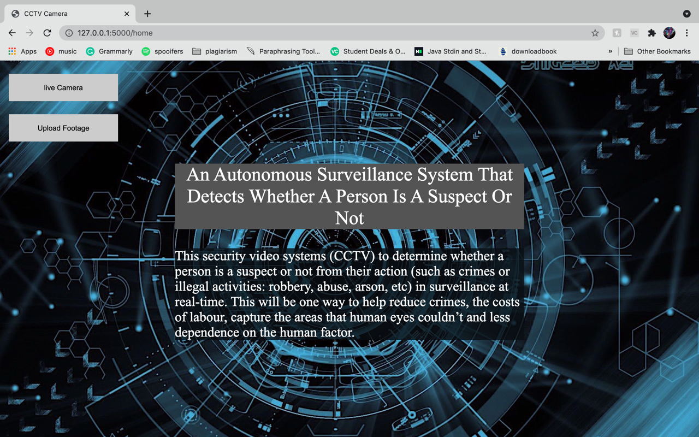

# An Autonomous Surveillance System That Detects Whether A Person Is A Suspect Or Not

This project allows determining whether a person is a suspect or not from their action (such as crimes or illegal 
activities: robbery, abuse, arson, etc) in surveillance at real-time. This will be one way to help reduce crimes, 
the costs of labour, capture the areas that human eyes couldn’t and less dependence on the human factor. To detect 
their behaviour, the Faster R-CNN deep learning algorithm, and VGG16 for an image pre-trained image classification is 
used.



## Launch the website:
### video uploading detection
Once they upload a video, it starts the detection process by handling video upload on the local server using POST
method in the flask as a server-end point. Then, it will extract the input video into one frame per second, which will
be stored in a test image folder. These image frames will be used to process the testing using Faster R-CNN on
VGG 16 network (Faster R-CNN on VGG 16 network.
After the Detection process is done, displaying the detected results as a video output. Also, displaying graph results 
such as ground truth classes, predicted classes, mAP, Precision and Recall calculations.

### live-streaming detection
The live detection done by getting an image frame for every 3 seconds from backend end-point services
(from flask API via call HTTP API (using AJAX in a browser). These image frames will be used to process the testing
using Faster R-CNN on VGG 16 network.
After the Detection process is done, displaying the output the bounding boxes, name of the crime that occurs in the
image frame, accuracy score and alert message as a warning sign to alert the user that there is a suspicious person
is found.

### [Slides](https://universityofexeteruk-my.sharepoint.com/:p:/g/personal/pt366_exeter_ac_uk/EfJkoxB5-IRIg64ezPumGkMB_ilvVqeJ8CZg_VPhHPpvLQ?email=pt366%40exeter.ac.uk&e=luOddw)

## Usage and Requirements:
* Tensorflow and keras backends are supported.

* Install all the packages from the `requirements.txt` to run this project.

* Test videos are found in the `test_videos` folder in `data` folder.

* The dataset for Training contains 6 different anomalies data such as Arson, Assault, Burglary, Fighting, Shooting 
  and Shoplifting. The total training video is 34 and producing a total of 28382 video frames. Each selected anomaly 
  class contain around 4000 t0 78000 image frames in total. 
  To convert those selected videos extracted into frames by getting the starting and ending frames of instance and 
  discarding all the negative number. The negative number means no anomalous event has occurred. For example, 
  
    - if Assault028_x264.mp4, Assault, 165, 240, -1, -1
        The third column is the starting frame of the event, and the fourth column is the ending frame of the event. The 
        negative number column will be discarding it. 
      
    - if Assault048_x264.mp4, Assault, 15, 75, 100, 250
        The third and fifth column is the starting frame of the event and the fourth and sixth column is the ending 
      frame of the event.

* `config.py` is used to control and change the parameters of the model for training and testing according to their
    needs. This file is found in the fast_rcnn folder.

* `simple_parser.py` allows to Parse the data from annotation file for training and testing process.Also,
  Provides an annotation file in a format of:
          `filepath,x1,y1,x2,y2,class_name`
  The x1 and y1 set as 1 for the starting bounding boxes. The x2 and x2 set as the maximum size of the 
  frame for ending bounding boxes.
    For example:

  - /data/imgs/img_001.jpg,1,1,981,456,Abused
  - /data/imgs/img_002.jpg,1,1,279,391,Shooting

* `data` folder contains:
  - `result_graphs` folder - storing graph results such as ground truth classes, predicted classes, mAP, Precision 
  and Recall calculations. 
  - `result_videos` folder - storing the detected results video. 
  - `result_images` folder - the detected results are stored in images. This will be converted into video.
  - `test_videos` folder - storing all videos that can be used for testing. Also, these videos are stored from 
    the uploaded video in the website.
  - `train_images` folder - storing extracted image frames from the train videos.
  - `train_videos` folder - storing the train videos.
  - `annotate.csv` file - new annotation file is created by containing the information of each image frame in a format of:
                            `filepath,x1,y1,x2,y2,class_name`
  - `model_frcnn.hdf5` file - storing weights that has the highest classification accuracy for bounding boxes from RPN.
  - `config.pickle` file - act as a dictionary by containing 'boxes', and a 'labels' key
  - `Temporal_Anomaly_Annotation.txt` file - is used to get information about getting the starting and ending frames of 
  instance in each training video.
  - `train_process_data.csv` file - storing train data such as loss rpn classifier, loss rpn regression, loss class 
  classifier, loss class regression, total_loss and class_accuracy for each number of epochs.

## Instructions to run
* Launch the website by calling,
    ```bash
      python app.py
    ```
  
* `format_dataset.py` is used to convert training videos in the 'train_videos' folder into image frames. These image 
frames will be stored in the 'train_images' folder. If there are no image frames in 'train_videos' folder, simply do:
    ```bash
      python format_dataset.py
    ```

* If there is no training has been done, or no `model_frcnn.hdf5` and `config.pickle` are found in the `data` folder,
  then the `train_frcnn.py` can be used to train a model. To train, simply do: 
  ```bash
    python train_frcnn.py
  ```
  
* `test_frcnn.py` can be used to perform inference, given pretrained weights, and a config file. Specify a path to the folder containing
images:
   ```bash
    python test_frcnn.py
   ```

## Example output:


## Built With
* Python -  support up to python 3.8.0.
